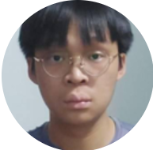
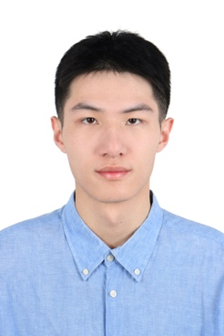

We are a team based in the [School of Computing, National University of Singapore](https://www.comp.nus.edu.sg).

You can reach us at the email `seer[at]comp.nus.edu.sg`

## Project team

### Ong Jun Yi

[[homepage](http://www.comp.nus.edu.sg/~damithch)]
[[github](https://github.com/ojunyi/)]
[[portfolio](team/ojunyi.md)]

* Role: Project Advisor

### Jin Liangdong

[[github](http://github.com/jyc300564)]
### Teh Ming Wei

[[github](http://github.com/tehmiw)]

* Role: Team Lead
* Responsibilities: UI

### Gao Ze

[[github](https://github.com/gaoze24)]
[[portfolio](team/gaoze24.md)]

* Role: Developer

### Jean Doe

[[github](http://github.com/johndoe)]
[[portfolio](team/gaoze24.md)]

* Role: Developer
* Responsibilities: Dev Ops + Threading

### Zhang Qixiang

[[github](https://github.com/ZhangQixiang123)]
[[portfolio](team/zhangqixiang123.md)]

* Role: Developer
